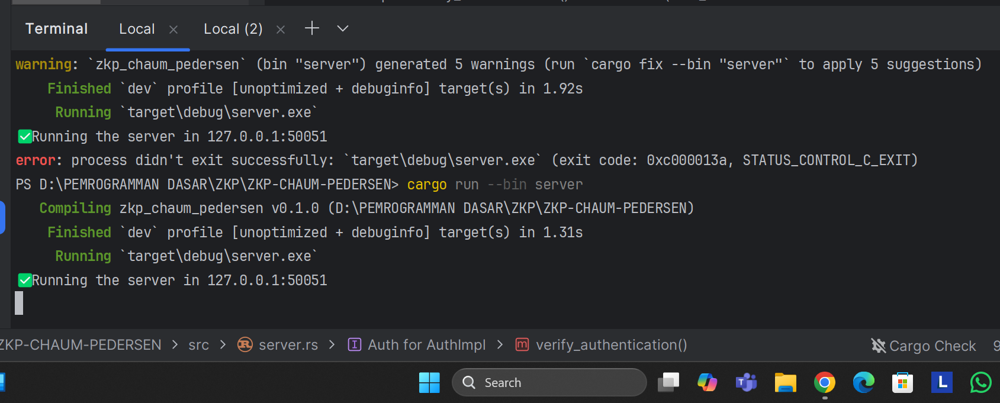
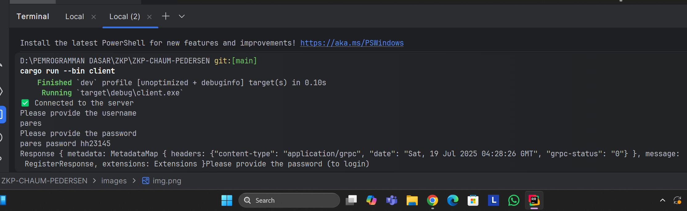
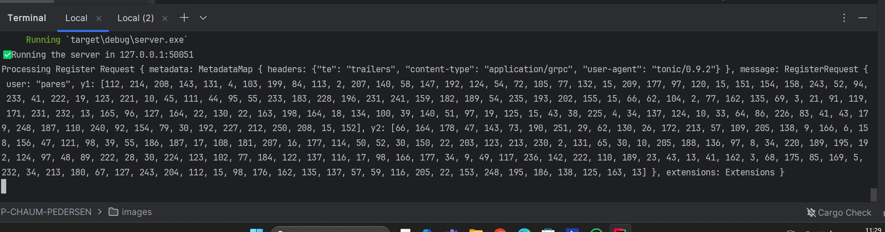
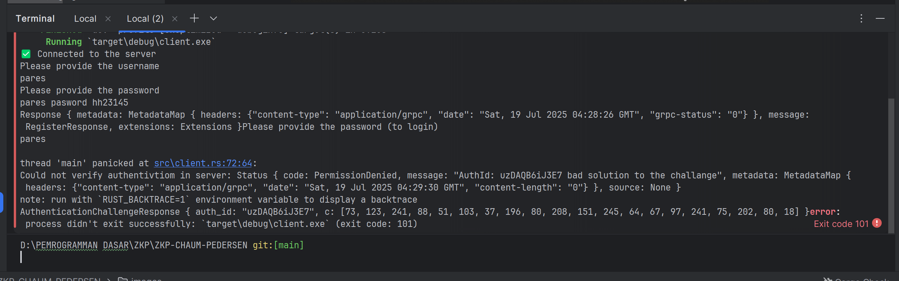
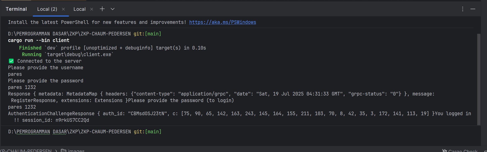
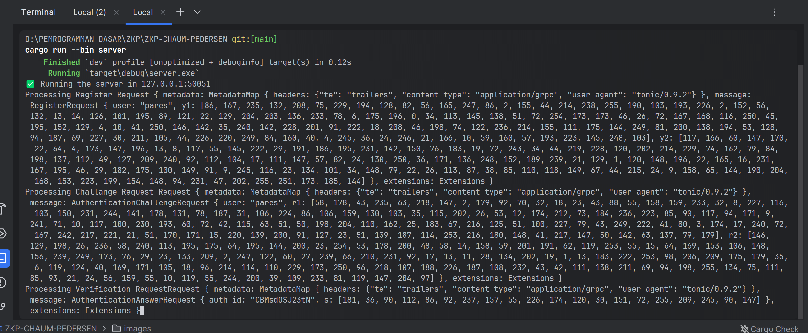

# 🔐 ZKP Chaum-Pedersen Protocol in Rust

[](./LICENSE)

> Zero-Knowledge Proof implementation of the Chaum-Pedersen protocol using pure Rust.

## 📚 Overview

This project demonstrates a basic implementation of the **Chaum-Pedersen Zero-Knowledge Proof Protocol** in Rust. It serves as an educational and experimental tool for learning and understanding how non-interactive proofs of knowledge can be constructed over discrete log equality.

> 💡 The Chaum-Pedersen protocol proves that two discrete logarithms are equal **without revealing the secret** — a core concept in Zero-Knowledge Proofs (ZKP).

## ⚙️ Features

- [x] Generate public/private key pairs
- [x] Create and verify Chaum-Pedersen proofs
- [x] Modular design with separation of logic
- [ ] gRPC support via Tonic (WIP)
- [ ] CLI or Web interface (planned)

## 🛠️ Tech Stack

- **Rust** — main programming language
- **num-bigint** — for big integer operations
- **rand** — for cryptographically secure randomness
- **tonic** — to build authentication via gRPC
- **protobuf** — interface definition for gRPC

## 📐 Mathematical Background

This protocol demonstrates a **non-interactive zero-knowledge proof** for **discrete logarithm equality**.

We prove knowledge of a secret `x` such that:

α = g^x mod p
β = h^x mod p


Where:

- `g`, `h` — generators in a multiplicative group modulo `p`
- `p`, `q` — large primes, with `q | p - 1`
- `α`, `β` — public values derived from `x`
- `x` — secret (e.g., password-derived)
- `modpow(a, b, p)` — modular exponentiation: `a^b mod p`

---

### 🧠 Prover's Computation

The prover computes:

s = k - c * x mod q

t1 = g^s * α^c mod p

t2 = h^s * β^c mod p


### ✅ Verifier's Check

The verifier checks that the hash of `(t1, t2)` equals the challenge `c`:

c == Hash(t1 || t2)


This ensures that the prover knows the same `x` for both `α` and `β` without revealing it.


## 🚀 Running the Project

### Prerequisites

- Rust (latest stable version recommended)
- [Protobuf Compiler (`protoc`)](https://grpc.io/docs/protoc-installation/) for gRPC support
- Clone this repo:

```bash
git clone https://github.com/ParesSensei/ZKP-protocol-in-rust.git
cd ZKP-protocol-in-rust
cargo build
cargo run --bin server
```
output: 




open new terminal
```bash
cargo run --bin client
```
provide name and password in client:



if succes then the output: 



then user will ask pasword for login, if password incorrect:



than try again with correct pasword for login and the output is:



